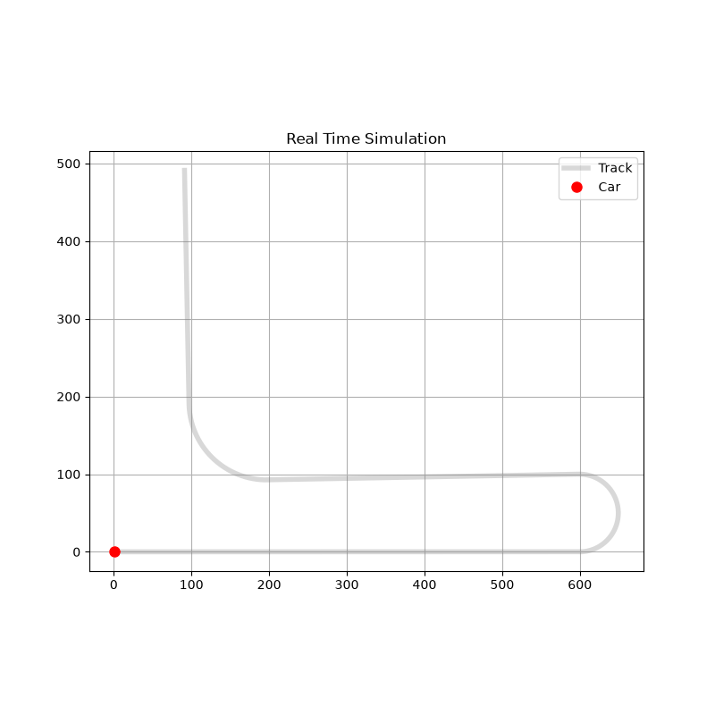

# 2D Formula 1 Vehicle Dynamics Numerical Simulator

A custom Python-based numerical solver developed to simulate and analyze the 2D kinematics and vehicle dynamics of high-performance racing cars. The project serves as a computational sandbox for translating classical mechanics and aerodynamic principles into discrete algorithmic models, extracting actionable telemetry data such as G-G diagrams and velocity profiles.


> *Visualization of the simulation output over the track geometry.*

## 🚀 Core Features

* **Aerodynamic Modeling:** Calculates speed-dependent aerodynamic forces, computing Drag ($F_d$) and Downforce ($F_z$) to dynamically update the vertical load and traction limits.
* **Adherence Limits (Kamm Circle):** Implements a kinematic friction circle to calculate the maximum combined lateral and longitudinal acceleration available at any given simulation step.
* **Trail Braking Algorithm:** Simulates optimal deceleration profiles entering corners, blending brake release with steering input requirements.
* **Telemetry Generation:** Extracts spatial and temporal arrays to generate standard motorsport engineering plots (G-G diagrams, V-Target profiles).

## ⚙️ Physics Model & Current Simplifications

To establish a baseline numerical framework, the current release operates under several idealized mechanical assumptions:

* **Point-Mass Kinematics:** The vehicle is treated as a 2D point mass. It currently ignores longitudinal/lateral weight transfer, roll centers, and suspension kinematics.
* **Idealized Tire Friction:** Uses a constant coefficient of friction ($\mu$), bypassing tire load sensitivity (e.g., Pacejka Magic Formula) and slip-angle dynamics.
* **Simplified Aerodynamics:** Aerodynamic coefficients ($C_d$, $C_l$) remain constant, ignoring ride-height sensitivity (aero maps) and center of pressure (CoP) migration. Wind vectors are assumed to be zero.
* **Forward Euler Integration:** First-order numerical integration is used for the current solver, which may introduce minor numerical drift in non-conservative forces over long track distances.

## 💻 Usage

The entire simulation logic and track parameterization are currently self-contained within a single script for rapid prototyping and execution.

1. Clone the repository:
   ```bash
   git clone [https://github.com/MathiasAgustinCusteau/Primer-circuito.git](https://github.com/MathiasAgustinCusteau/Primer-circuito.git)

2. Ensure you have the required dependencies installed:
   ```bash
   pip install numpy matplotlib IPython

3. While the script can be executed from a standard terminal, it is heavily recommended to run it within an interactive Python environment (e.g., Jupyter Notebook, Spyder, or VS Code Interactive Window) to properly render the real-time telemetry animations. Standard terminal execution may only output the final static frames.

## 🗺️ Roadmap & Future Architecture
The codebase is actively being refactored to support higher-fidelity simulations and scalable architecture. Upcoming milestones include:

* Modularization: Splitting the monolithic script into isolated modules (physics.py, track.py, driver.py, simulation.py).

* Data Ingestion: Replacing hardcoded parametric tracks with the ability to import generic .csv track coordinate datasets.

* Numerical Stability: Upgrading the solver from Forward Euler to a 4th-Order Runge-Kutta (RK4) integration method.

* Tire Dynamics: Implementing empirical tire load sensitivity curves to prepare the environment for future mass-transfer calculations.

* Language: Translating plots and code comments to English for easier understanding and utility


Developed as an independent computational physics project to explore the intersection of numerical analysis and motorsport engineering.